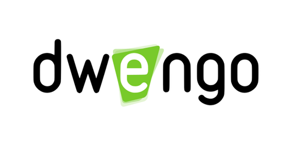

# link pdf

[Vergadering pdf!](vergadering.pdf)

# link audio

[Momo!](momo.mp3)

# link yt

[Ricky!](https://www.youtube.com/watch?v=dQw4w9WgXcQ)

# link leerobj

[link](@learning-object/61162bc660eac2f339c606ef "dit is een leerobject")

# link afbeelding

[afbeelding](dwengo_logo.png "dit is een afbeelding")

# afbeelding

# yt

# pdf

# blocks

# Jupyter notebook

# audio

# leerobj

