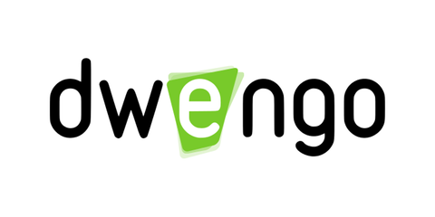

# Dit is les 2
[Klik hier om de vorige les te bekijken](@learning-object/6103f4c4405e137f9cc44adb "Les 1")

## Deel 2.1

Om deze les beginnen, zal je eerst deze video moeten bekijken:

Nu kunnen we beginnen aan het belangrijkste deel van deze les.

- Puntje 1
- Puntje 2
- 

...
